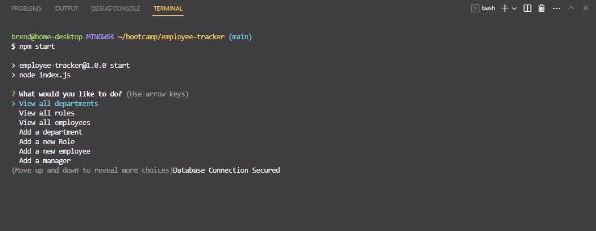

# Employee Tracker

[](https://opensource.org/licenses/MIT)

## Description

Employee Tracker is a command-line Content Management System (CMS) designed to help businesses efficiently manage their employee data. This application is built using Node.js, Inquirer, mysql2, and MySQL, and it allows users to interact with the system using the arrow keys for navigation. With Employee Tracker, users can perform various actions, such as viewing departments, roles, and employees, adding new departments, roles, and employees, updating an employee's role, and more.

## Installation

Before running the Employee Tracker application, please ensure you have the following prerequisites installed on your system:

[Node.js](https://nodejs.org/)

[MySQL](https://www.mysql.com/)

Follow these steps to set up the application:

Navigate to the project's [GitHub](https://github.com/brendan-aper/Employee-Tracker)

**Clone the repository from GitHub:**
```
git clone https://github.com/brendan-aper/Employee-Tracker.git
```

**Navigate to the project directory:**
```
cd employee-tracker
```

**Install the required dependencies:**
```
npm install
```

**Set up the MySQL database:**

Create a MySQL database and schema using the provided SQL file (schema.sql).

**Update database connection details:**

Open the connection.js file and replace the placeholders **(YOUR_HOST, YOUR_USER, YOUR_PASSWORD,** and **YOUR_DATABASE)** with your MySQL credentials.

**Launch the Employee Tracker application:**

```
npm start
```
**OR**
```
node index.js
```

## Usage

Once you start the Employee Tracker application, you will be presented with a menu of options. You can navigate through the menu using the arrow keys and select the desired option by pressing the "Enter" key.



### Main Menu
**View All Departments:** Select this option to view a formatted table displaying all department names and IDs.

**View All Roles:** Select this option to view a formatted table displaying all job titles, role IDs, the corresponding departments, and salaries.

**View All Employees:** Select this option to view a formatted table showing all employee data, including employee IDs, first names, last names, job titles, departments, salaries, and their managers.

**Add a Department:** Select this option to add a new department to the database. You will be prompted to enter the name of the department.

**Add a Role:** Select this option to add a new role to the database. You will be prompted to enter the name, salary, and department for the role.

**Add an Employee:** Select this option to add a new employee to the database. You will be prompted to enter the employee's first name, last name, role, and manager.

**Update an Employee Role:** Select this option to update an employee's role. You will be prompted to select an employee to update and choose their new role.

**Update Employee Managers:** Select this option to update an employee's manager. You will be prompted to select an employee and choose their new manager.

**View Employees by Manager:** Select this option to view employees based on their manager. You will be prompted to select a manager, and a formatted table of employees under that manager will be displayed.

**View Employees by Department:** Select this option to view employees based on their department. You will be prompted to select a department, and a formatted table of employees in that department will be displayed.

**Delete Departments, Roles, and Employees:** Select this option to delete existing departments, roles, and employees from the database. You will be prompted to choose the type of data you want to delete (department, role, or employee) and select the specific item to delete.

**View Total Utilized Budget of a Department:** Select this option to view the total salary budget of a specific department. You will be prompted to choose a department, and the total combined salaries of all employees in that department will be displayed.

### Exiting the Application
To exit the application, select the "Quit" option in the main menu.

You can also view this [Video Walkthrough](https://drive.google.com/file/d/1U74BuwdhOzYAqSwEs1yQCKmv4mcXZABK/view)

## Contributing
No contributions are taken at this time.

## Questions
If you have any questions about the project feel free to [Email Me](mailto:brendanaper@gmail.com)

Follow me on [GitHub](https://github.com/brendan-aper)

## License

This project is licensed under the [MIT License](https://opensource.org/license/mit/).